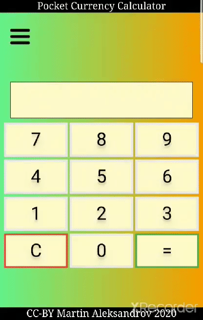

# Mobile Currency Calculator

[Mobile Demo](https://devweb2019.cis.strath.ac.uk/~kwb17166/mad/first/index.html).

#### A vanilla JavaScript pocket calculator you can use while in a hurry.

The currency converter is written in HTML5, JavaScript and CSS. The aim is that this is a quick calculator for travellers, e.g. Sam who lives in Scotland and is visiting Germany. The user is be able pick their home (e.g for Sam £) and visiting currencies (e.g. for Sam €). The set of currencies should be limited to those provided by the ECB. As the user is visiting another currency zone, conversions should be from "visiting" to "home" to give them an idea how much something would cost in their normal currency and give an idea how much the bill will be on a card when the user gets home.

The app uses AJAX to get The European Central Bank (ECB) rates then saves these locally, uses local rates for the calculator and works offline with no network access (updating the rates only when the page/app is loaded (if there’s a network)).
